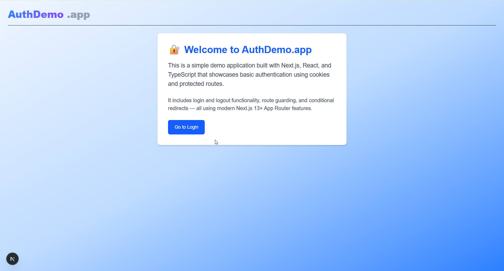
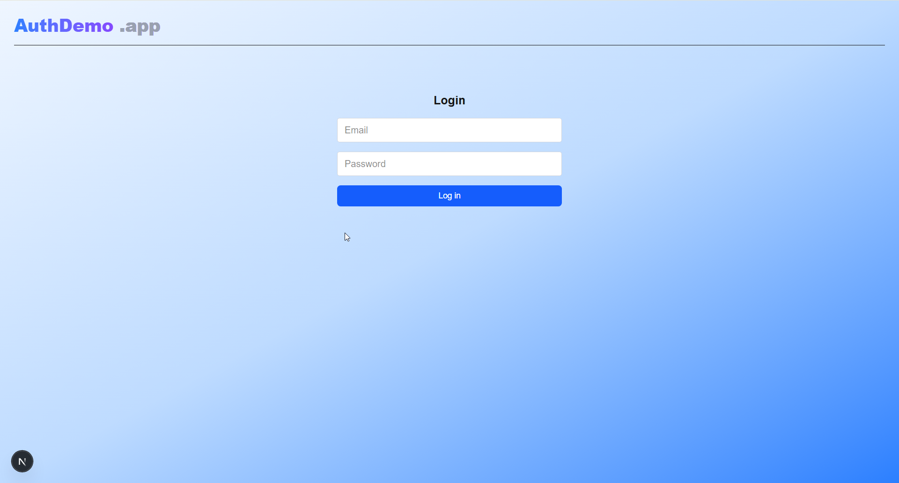
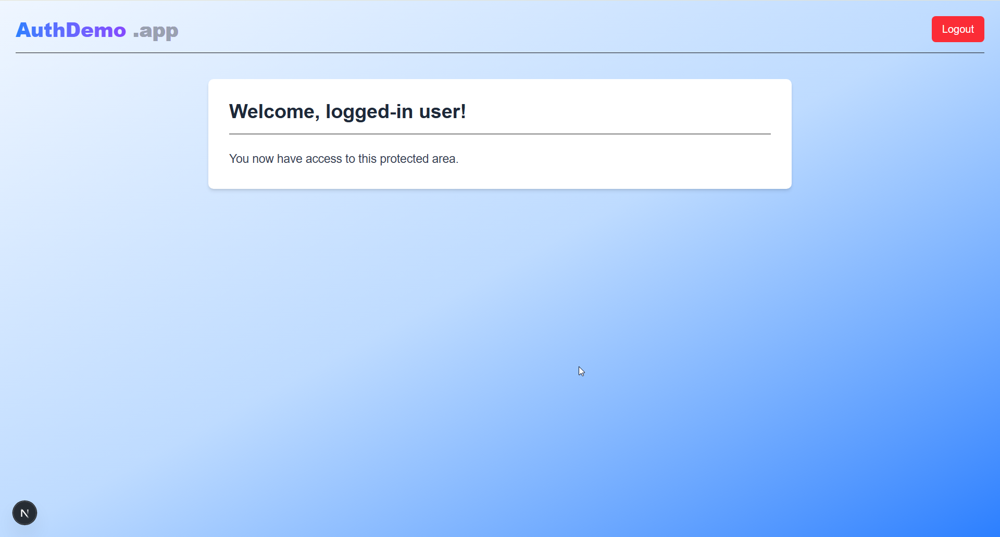

# Modular Authentication Example with Next.js

[](https://nextjs.org)
[](LICENSE)
[](https://github.com/your-org/your-repo/actions/workflows/ci.yml)

A **production‑ready** reference project that shows how to build a **pluggable authentication layer** in the Next.js _App Router_ using cookies, dependency‑injection, and provider interfaces.

> **Why this repo?**  
> Swap auth back‑ends (cookies, Azure AD, Supabase, Auth0…) with **one env flag** while keeping your React code clean and testable.

---

## ✨ Features

- **Modular auth providers** – implement the `AuthProvider` interface once, plug‑in many back‑ends.  
- **Service Locator** (`AuthRegistry`) – run‑time DI with zero 3rd‑party libs.  
- **Cookie demo provider** – secure `HttpOnly` cookie sessions out of the box.  
- **User data abstraction** – switch from JSON to DB without touching auth logic.  
- **Type‑safe** – written in TypeScript, no `any` (ts‑strict mode).  
- **Quality gates** – ESLint, Prettier, Husky, and Vitest ready to go.  
- **1‑click  Vercel deploy** button.

---
## 📸 Screenshots

  
*A Landing page.*

  
*An Login prompt that communicates with a backend.*

  
*An authenticated dashboard after authentication.*

---

## 🔐 Authentication Overview

| Abstraction | File | Responsibility |
|-------------|------|----------------|
| `AuthProvider` | `src/lib/auth/AuthProvider.ts` | Contract: `login`, `logout`, `isAuthenticated`, `getUser` |
| `CookieAuthProvider` | `src/lib/auth/CookieAuthProvider.ts` | Default implementation using signed `HttpOnly` cookies |
| `UserDataProvider` | `src/lib/auth/UserDataProvider.ts` | Abstracts user look‑up/storage |
| `JsonUserDataProvider` | `src/lib/auth/JsonUserDataProvider.ts` | Reads `data/users.json`, falls back to an in‑memory test user |

### 1. AuthRegistry (Service Locator)

A singleton that maps a string key (e.g. `cookie`, `azure`, `supabase`) to an instance of an `AuthProvider`.

### Usage

1. **Initialization** (in `InitAuth.server.tsx`):  
   ```ts
   import { AuthRegistry } from '@/lib/auth/AuthRegistry';
   import { CookieAuthProvider } from '@/lib/auth/CookieAuthProvider.server';

   AuthRegistry.register('cookie', new CookieAuthProvider(/* config */));
   ```
2. **Selecting at runtime**:
   ```ts
   const providerKey = process.env.AUTH_PROVIDER || 'cookie';
   const auth = AuthRegistry.get(providerKey);
   ```
3. **Consuming in your code**:  
   Always call methods on the interface, never on a concrete class:
   ```ts
   if (await auth.isAuthenticated(req)) {
     const user = await auth.getUser(req);
     // …
   }
   ```

### Core API

```ts
export interface AuthProvider {
  login(credentials: LoginDto): Promise<void>;
  logout(): Promise<void>;
  isAuthenticated(req: NextRequest): Promise<boolean>;
  getUser(req: NextRequest): Promise<User | null>;
}

export class AuthRegistry {
  private static providers = new Map<string, AuthProvider>();

  static register(key: string, provider: AuthProvider) {
    this.providers.set(key, provider);
  }

  static get(key: string): AuthProvider {
    const p = this.providers.get(key);
    if (!p) throw new Error(`No AuthProvider registered for "${key}"`);
    return p;
  }
}
```

---

## 2. Built‑in Modules

| Module                    | Files                                             | Responsibility                                      |
|---------------------------|---------------------------------------------------|-----------------------------------------------------|
| **CookieAuthProvider**    | `CookieAuthProvider.server.tsx`                   | JWT in signed `HttpOnly` cookie                     |
| **JsonUserDataProvider**  | `JsonUserDataProvider.tsx`                        | Reads `data/users.json`, falls back to in‑memory    |
| **Client / Server Variants** | `*.client.tsx` / `*.server.tsx`               | Split code so client bundles don’t include server SDKs |

---

## 3. Adding Your Own Provider

1. **Implement the interface**  
   ```ts
   export class AzureAdAuthProvider implements AuthProvider {
     async login(creds: LoginDto): Promise<void> { /* MSAL flow */ }
     async logout(): Promise<void> { /* clear tokens */ }
     async isAuthenticated(req: NextRequest): Promise<boolean> { /* validate MSAL token */ }
     async getUser(req: NextRequest): Promise<User | null> { /* call Graph API */ }
   }
   ```

2. **Register it** (e.g. in `InitAuth.server.tsx`)  
   ```ts
   AuthRegistry.register('azure', new AzureAdAuthProvider(/* opts */));
   ```

3. **Switch via env**  
   ```env
   AUTH_PROVIDER=azure
   ```

---

## 4. Other Providers You Might Plug In

| Provider Style      | Description                                                      |
|---------------------|------------------------------------------------------------------|
| OAuth2 Generic      | Any OAuth2 server (GitHub, Google…) via standard flows           |
| Auth0               | Hosted identity with rules, multi‑tenant support                 |
| Firebase Auth       | Email/password, social logins, anonymous sessions                |
| Supabase Auth       | Postgres‑backed JWTs with RLS                                    |
| AWS Cognito         | Amazon User Pools, SRP flows, hosted UI                         |
| Okta                | Enterprise SSO + OIDC                                            |
| Keycloak            | Self‑hosted SSO server                                           |
| Custom JWT‑only     | No cookies; use `Authorization: Bearer <token>` headers          |

_To add any of these:_  
1. write a small adapter that implements `AuthProvider`.  
2. register under its key.  
3. flip the `AUTH_PROVIDER` flag.

---

## Why This Matters

- 🚀 **Zero‑touch swapping** of auth back‑ends  
- 🧩 **UI agnostic**: no Azure/MSAL/Firebase imports in your React components  
- 🧪 **Easier testing**: register a “mock” provider in Vitest  
- 🔍 **Single registry**: central place to inspect and control all providers  

With this pattern, you can start with a simple cookie demo and seamlessly graduate to any enterprise‑grade identity solution—without rewriting your pages, hooks, or guards.


### Default Test User (fallback)

| Email | Password |
|-------|----------|
| `test@example.com` | `1234` |

---

## 🗂 Project Structure

```
src/
├─ app/
│  ├─ api/
│  │  ├─ login/
│  │  │  └─ route.tsx
│  │  ├─ logout/
│  │  │  └─ route.tsx
│  │  └─ me/
│  │     └─ route.ts
│  ├─ dashboard/
│  │  ├─ layout.tsx
│  │  └─ page.tsx
│  ├─ globals.css
│  ├─ layout.tsx
│  ├─ login/
│  │  ├─ layout.tsx
│  │  └─ page.tsx
│  └─ page.tsx
├─ lib/
│  ├─ auth/
│  │  ├─ AuthProviderClient.tsx
│  │  ├─ AuthProviderServer.tsx
│  │  ├─ AuthRegistry.tsx
│  │  ├─ CookieAuthClientProvider.client.tsx
│  │  ├─ CookieAuthProvider.server.tsx
│  │  ├─ InitAuth.client.tsx
│  │  ├─ InitAuth.server.tsx
│  │  ├─ JsonUserDataProvider.tsx
│  │  ├─ UserDataProvider.tsx
│  │  └─ dto/
│  │     └─ User.tsx
│  ├─ clientIdentity/
│  │  └─ ClientIdentity.tsx
│  ├─ constants/
│  │  ├─ auth.ts
│  │  └─ routes.ts
│  └─ logger/
│     ├─ ILogger.tsx
│     ├─ InitLogger.tsx
│     ├─ LoggerRegistry.tsx
│     ├─ WinstonLogger.tsx
│     └─ index.ts
```

---

## 🚀 Quick Start

```bash
# 1. Install deps
npm install

# 2. Copy env vars
cp .env.example .env.local

# 3. Run dev server
npm run dev

# Open http://localhost:3000
```

---

## ⚙️ Configuration Reference

Copy the `.env.example` to `.env.local` and update the values below:

```bash
# .env.local

# Secret for signing JWT tokens and cookie payloads
JWT_SECRET=your-very-long-random-string-here

# Name of the session cookie (HttpOnly, Secure)
SESSION_COOKIE_NAME=token

# Upstash Redis for rate-limiting (optional)
UPSTASH_REDIS_REST_URL=https://<your-upstash-url>
UPSTASH_REDIS_REST_TOKEN=<your-upstash-token>

# Active authentication provider key
# (defaults to 'cookie'; e.g., 'azure', 'supabase' when supported)
AUTH_PROVIDER=cookie
```

| Variable                  | Default     | Description                                              |
|---------------------------|-------------|----------------------------------------------------------|
| `JWT_SECRET`              | _(required)_| Secret for JWT signing and cookie encryption             |
| `SESSION_COOKIE_NAME`     | `token`     | Name of the session cookie                               |
| `UPSTASH_REDIS_REST_URL`  | _nullable_  | Upstash REST URL for Redis (rate limiting, sessions)     |
| `UPSTASH_REDIS_REST_TOKEN`| _nullable_  | Token for authenticating with Upstash REST API           |
| `AUTH_PROVIDER`           | `cookie`    | Active auth backend: `cookie` &#124; `azure` &#124; `supabase` |

---

## 🧪 Testing & Quality

```bash
# Type‑check
npm run typecheck

# Lint & format
npm run lint
npm run format

# Unit tests (Vitest)
npm test
```

Pre‑commit hooks block pushes that break lint, types, or tests.

---

## 📦 Deployment

| Target          | Command                                                                               |
|-----------------|---------------------------------------------------------------------------------------|
| **Vercel**      | Click **Deploy** → [](https://vercel.com/new) |
| Docker          | `docker build -t modular-auth-demo .`                                                 |
| Node (PM2)      | `npm run build && pm2 start npm --name auth-demo -- start`                            |

---

## 💡 Further Reading

- [Next.js App Router](https://nextjs.org/docs/app)
- [Using HttpOnly Cookies for Auth](https://owasp.org/www-community/HttpOnly)
- [bcryptjs](https://www.npmjs.com/package/bcryptjs)
- [Vitest](https://vitest.dev)
- [ESLint no‑magic‑numbers](https://eslint.org/docs/latest/rules/no-magic-numbers)

---

## 🤝 Contributing

1. `git clone` / fork
2. `git checkout -b feat/my-feature`
3. Code, test, `npm run lint`
4. Open PR – we ❤️ tests & clear commit messages.

---

## 📝 License

MIT © 2025 Atle Holm /atle@itautomasjon.no